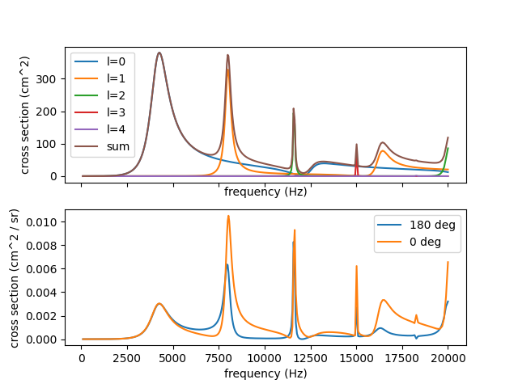

# soundscat

The propagation of sound can be described by a differential 
equation that is mathematically similar to the Schrodinger 
equation. Thus, many results and numerical techniques from 
quantum mechanical scattering theory apply equally well to 
sound waves.

Here, we take advantage of this connection to compute the 
scattering of sound waves by a sphere. Specifically, we 
use the quantum mechanical equations that describe the 
scattering of a spinless, neutral particle by a square-well 
potential to compute the scattering cross section of a 
sound wave striking an iso-velocity sphere using.

Note that the sound propagation medium is assumed to extend 
to infinity. A more realistic model would include proper 
boundary condition, e.g., the sea surface and bottom if 
the propagation medium is the ocean.

See the [soundscat.py] script for implementation details. 
Running the script should produce the below figure.

